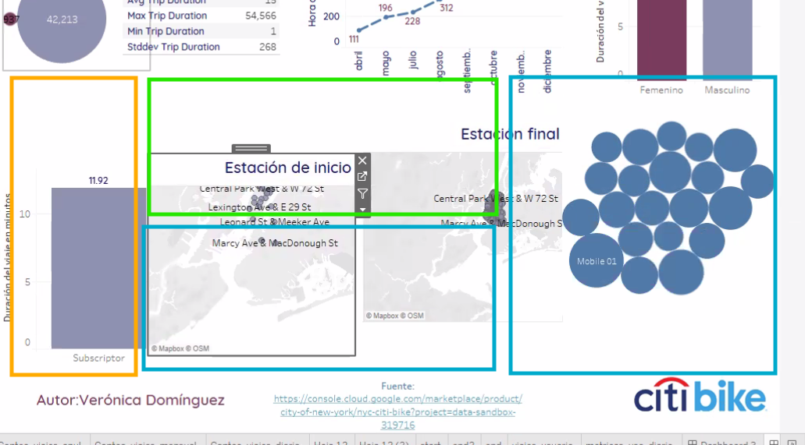
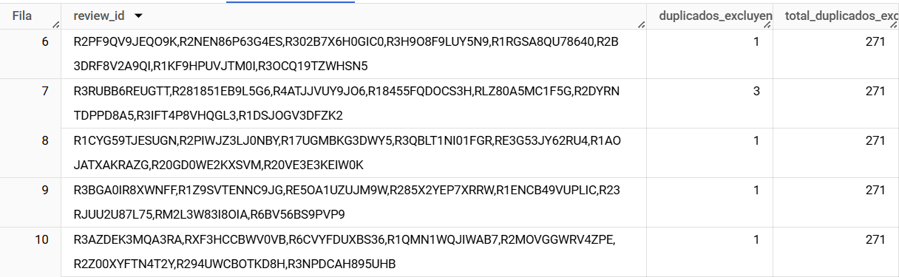
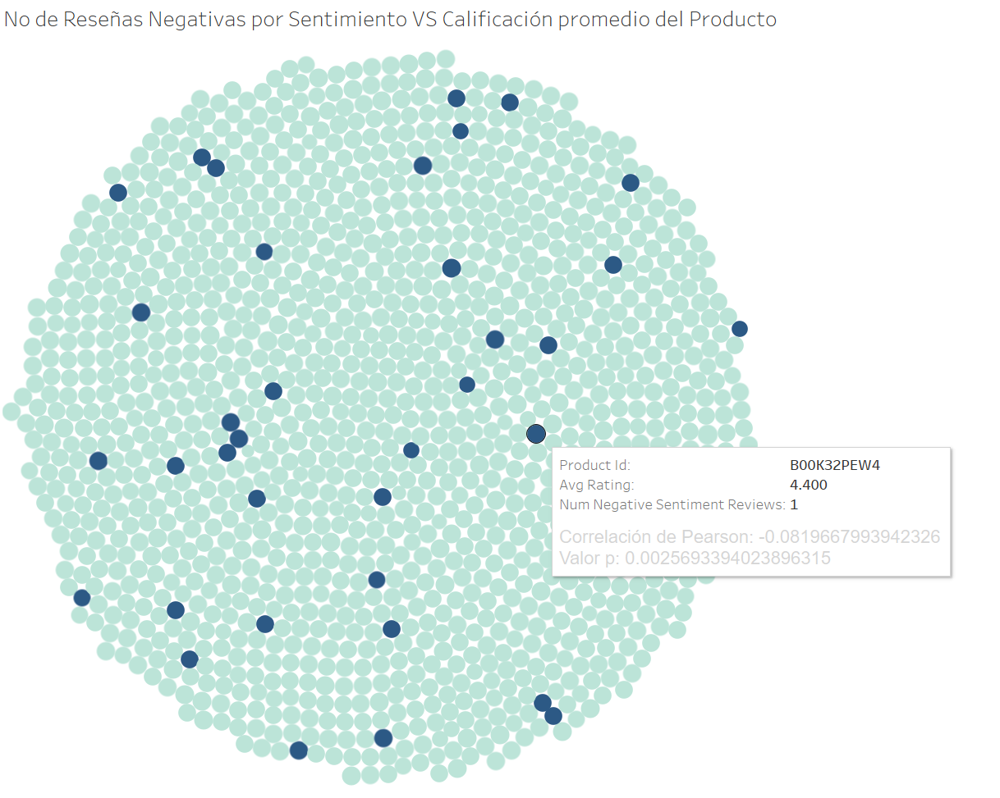

# Proyecto4_DataLab

### Temas

- [Introducción](#introducción)
- [Herramientas](#herramientas)
- [Procesamiento](#procesamiento)
  - [Limpieza de datos ](#limpieza_de_datos)
  - [Análisis exploratorio](#análisis_exploratorio)
  - [Hipótesis](#hipótesis)
  - [Score de Riesgo](#score_de_riesgo)
  - [Regresión Logistica](#regresion_logistica)
- [Conclusiones](#Conclusiones)
- [Recomendaciones](#Recomendaciones)
- [Recursos](#Recursos)

## Introducción

Datalab, una empresa de consultoría innovadora que se especializa en el análisis de datos, con el objetivo de ofrecer soluciones analíticas avanzadas.

Datalab se ha establecido como un socio de confianza para una variedad de empresas en distintos sectores. Su modelo de consultoría único permite a sus analistas de datos seleccionar proyectos que se alineen con sus intereses y experiencia, optimizando así la aplicación de sus habilidades técnicas en los contextos donde pueden tener un mayor impacto

### Objetivo

 El objetivo de este análisis es entender las tendencias y patrones en las calificaciones y reseñas de productos disponibles en Amazon, con el fin de proporcionar insights que puedan ayudar a mejorar la estrategia de precios, descuentos y satisfacción del cliente. 

### **Herramientas**
  1. Google BigQuery
  2. Google Colab
  3. Google Looker Studio
  4. Visual Studio

## **Procesamiento**

### 1.1 Limpieza de datos 

Se realiza exploracion de los dos data set proporcionados:

1.- Nulos

amazon_product
  * about_product - 4
  * discount_percentage - 0
  * actual_price - 0
  * category - 0
  * product_name - 0
  * product_id - 0
  * user_id - 0
  * discounted_price - 0

  Acciones: Se eliminan los 4 nulos de about_product

amazon_review
  * user_id - 0
  * user_name - 0
  * review_title - 0
  * review_id - 0
  * review_content - 0
  * img_link - 466
  * product_link - 466
  * product_id - 0
  * rating - 0
  * rating_count - 2

2.- Duplicados

amazon_product
  * about_product - 130
  * discount_percentage - 89
  * actual_price - 190
  * category - 136
  * product_name - 102
  * product_id - 96
  * discounted_price - 1870

  En la columna product_id, identificamos 96 valores únicos que originalmente estaban duplicados. Sin embargo, estos valores aparecen duplicados múltiples veces, resultando en un total de 214 duplicados en el dataset. Esto significa que hay 118 duplicados adicionales que no fueron contabilizados inicialmente.

  > duplicados product id (desglose)
  >

amazon_review
  * user_id - 144
  * user_name - 144
  * review_title - 144 originales (271 omitidos)
  * review_id - 144 originales (271 omitidos)
  * review_content - 141 originales (253 omitidos)
  * img_link - 49
  * product_link - 1
  * product_id - 92
  * rating - 21
  * rating_count - 204 

En las columnas review_title y review_id, identificamos 144 valores únicos que originalmente estaban duplicados. Sin embargo, estos valores aparecen duplicados múltiples veces, resultando en un total de 415 duplicados en el dataset. 
Por otro lado, en la columna review_content, identificamos 141 valores únicos que originalmente estaban duplicados. Estos valores también aparecen duplicados múltiples veces, resultando en un total de 394 duplicados en el dataset,.

  Se analizan las variables para determinar cuales duplicados podrian ser considerados importantes:

  + review_id: Este identificador debería ser único para cada reseña. Duplicados en este campo podrían indicar un problema serio en la integridad de los datos, como la inserción repetida de registros.
  + product_id:  Este campo identifica de manera única a un producto. Si bien un producto puede tener muchas reseñas, la duplicación de product_id en combinación con otros campos podría sugerir que se han repetido registros de productos, lo que podría causar problemas al analizar la cantidad de productos únicos.
  + review_title y review_content: Estos campos contienen el contenido textual de las reseñas. Duplicados aquí podrían indicar que los usuarios están publicando reseñas repetidas, lo que podría considerarse como spam o contenido duplicado.

Duplicados desglosados
>
>

3.- Valores fuera del alcance 

amazon_product
  * about_product - 0
  * discount_percentage - 315 porcentajes que no coinden con el discounted_price
  * actual_price - 0 precios correctos
  * category - 0
  * product_name - 0 
  * product_id - 0
  * discounted_price - 0

>
>

amazon_review
  * user_id - 0
  * user_name - 0
  * review_title - 0
  * review_id - 0
  * review_content - 0
  * img_link - 0
  * product_link - 0
  * product_id - 0
  * rating - 0
  * rating_count - 

### 1.2 Análisis exploratorio

### 1.3 Hipótesis

## Score de Riesgo
## **Regresión Logística**

### **Conclusiones**

### **Recomendaciones**

## **Recursos**

### Presentación del Proyecto 
Accede a la presentación del proyecto haciendo clic [aquí](https://drive.google.com/file/d/1GdkslQ3pPk7i1k2rmBQY7mdTkbuySkSC/view?usp=sharing)