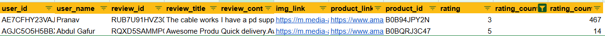
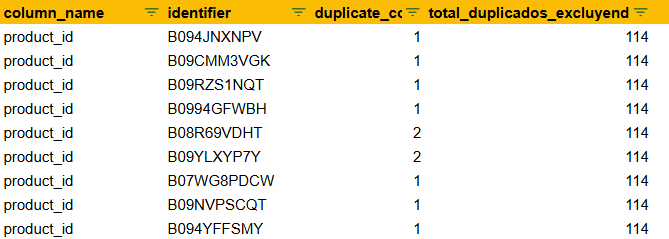

# Proyecto4_DataLab

### Temas

- [Introducción](#introducción)
- [Herramientas](#herramientas)
- [Procesamiento](#procesamiento)
  - [Limpieza de datos ](#limpieza_de_datos)
  - [Análisis exploratorio](#análisis_exploratorio)
  - [Hipótesis](#hipótesis)
  - [Score de Riesgo](#score_de_riesgo)
  - [Regresión Logistica](#regresion_logistica)
- [Conclusiones](#Conclusiones)
- [Recomendaciones](#Recomendaciones)
- [Recursos](#Recursos)

## Introducción

Datalab, una empresa de consultoría innovadora que se especializa en el análisis de datos, con el objetivo de ofrecer soluciones analíticas avanzadas.

Datalab se ha establecido como un socio de confianza para una variedad de empresas en distintos sectores. Su modelo de consultoría único permite a sus analistas de datos seleccionar proyectos que se alineen con sus intereses y experiencia, optimizando así la aplicación de sus habilidades técnicas en los contextos donde pueden tener un mayor impacto

### Objetivo

 El objetivo de este análisis es entender las tendencias y patrones en las calificaciones y reseñas de productos disponibles en Amazon, con el fin de proporcionar insights que puedan ayudar a mejorar la estrategia de precios, descuentos y satisfacción del cliente. 

### **Herramientas**
  1. Google BigQuery
  2. Google Colab
  3. Tableu
  4. Visual Studio

## **Procesamiento**

### 1.1 Limpieza de datos 

Se normalizan los datos de la tabla amazon_review.

Se realiza exploracion de los dos data set proporcionados:

1.- Nulos

Tabla: amazon_product
  * about_product - 4
  * discount_percentage - 0
  * actual_price - 0
  * category - 0
  * product_name - 0
  * product_id - 0
  * user_id - 0
  * discounted_price - 0

>Nulos
>

      Acciones: Se eliminan los 4 nulos de about_product

Tabla: amazon_review
  * user_id - 0
  * user_name - 0
  * review_title - 0
  * review_id - 0
  * review_content - 0
  * img_link - 466
  * product_link - 466
  * product_id - 0
  * rating - 0
  * rating_count - 2

>Imputación de nulos en raiting_count
>

        Acciones: 
        + Valores nulos en img_link y product_link: Se decidió mantener los valores nulos en estas columnas ya que no son variables críticas para el análisis.
        + Imputación de valores en rating_count: Se calcularon las medias de rating_count basadas en los valores de rating. Para el rating de 5, la media fue de 14, mientras que para el rating de 3, la media fue de 467. Estos valores fueron utilizados para imputar los nulos en rating_count.
 

2.- Duplicados

Tabla: amazon_product
  * about_product - 130
  * discount_percentage - 89
  * actual_price - 190
  * category - 136
  * product_name - 102
  * product_id - 96
  * discounted_price - 1870

  > duplicados product id (desglose)
  >

    Acciones:
     + En la columna product_id, identificamos 96 valores únicos que originalmente estaban duplicados. Sin embargo, estos valores aparecen duplicados múltiples veces, resultando en un total de 214 duplicados en el dataset. Esto significa que hay 118 duplicados adicionales que no fueron contabilizados inicialmente, por lo que se decide a eliminarlos de nuestro data_set, como resultado, se obtuvieron un total de 1,351 registros únicos.

Tabla: amazon_review
  * user_id - 144
  * user_name - 144
  * review_title - 144 originales (271 omitidos)
  * review_id - 144 originales (271 omitidos)
  * review_content - 141 originales (253 omitidos)
  * img_link - 49
  * product_link - 1
  * product_id - 92
  * rating - 21
  * rating_count - 204 

Duplicados desglosados
>
>

    Acciones: 
    + En la columna product_id, identificamos 92 valores únicos que originalmente estaban duplicados. Esto significa que hay 114 duplicados adicionales que no fueron contabilizados inicialmente, por lo que se decide a eliminarlos de nuestro data_set, como resultado, se obtuvieron un total de 1,351 registros únicos.

3.- Valores fuera del alcance 

Tabla: amazon_product
  * about_product - 4 datos faltantes
  * discount_percentage - 315 porcentajes que no coinden con el discounted_price
  * actual_price - 0 precios correctos
  * category - 0
  * product_name - 0 
  * product_id - 0
  * discounted_price - 0

Se llevó a cabo una verificación de la consistencia y coherencia de los precios y descuentos registrados en la tabla amazon_product, con el objetivo de identificar y corregir posibles errores en los datos antes de realizar análisis más profundos o tomar decisiones informadas. Esta validación garantiza que los precios y descuentos reflejen con precisión la realidad del producto, preservando la integridad y confiabilidad de los datos. Se encontraron 27 product_id, que presentan algún tipo de inconsistencia entre discounted_price, actual_price y discount_percentage.

Tabla: amazon_review
  * user_id - 0
  * user_name - 0
  * review_title - 0
  * review_id - 0
  * review_content - 0
  * img_link - 0
  * product_link - 0
  * product_id - 0
  * rating - 0
  * rating_count - 

Se detectan variables con una cadena de valores dividida por comas o puntos en una misma varible ("user_id", "user_name","review_title", "review_id", "review_content"). 

En el proceso de limpieza y transformación se dividió la categoría de los productos en varias columnas para facilitar su análisis. También se limpió la columna que describe los productos eliminando caracteres no deseados, como emojis, paréntesis y espacios innecesarios, asegurando que el texto quedara libre de ruido.

Adicionalmente, se analizó la columna de identificadores de usuarios, contando cuántos ID estaban presentes en cada registro. Las reseñas también fueron limpiadas de signos, emojis y otros caracteres no alfabéticos, dejando solo el texto relevante para el análisis. Estas transformaciones permiten trabajar con un conjunto de datos más estructurado y limpio, adecuado para análisis posteriores y generación de insights. Concluyendo en una sola tabla que se llama datset.

>
>

4.- Normalización de datos

Derivado de la exploración se toma la decisión de normalizar los datos para evitar redundancias al eliminar los user_id y review_id excedentes.

>
>

### 1.3 Análisis exploratorio

1.- Agrupación de las variables categoricas

  * Visualización de la distribuición de los productos

  >
  > 

  * Visualizacion de productos con Top Rating

  >
  > 

  
  * Visualizacion de medidas de tendencia central

  >
  >

  * Distribuición de las variables
  
  Raiting:
  >
  >

    Interpretación: La mayoría de los usuarios parecen estar bastante satisfechos, ya que la mayoría de las calificaciones se sitúan en el rango de 4.0 a 4.5. Existen pocos usuarios que hayan dado calificaciones significativamente bajas (por debajo de 3.0).

  * Cuartiles
  >
  >

  ### 1.2 Análisis de Sentimiento

El análisis de sentimiento, también conocido como minería de opinión, es una técnica de procesamiento de lenguaje natural (NLP) utilizada para identificar y extraer información subjetiva de un texto. Su objetivo principal es determinar la actitud, opinión o emoción de un autor respecto a un tema, producto o servicio en particular. El análisis de sentimiento clasifica el texto en categorías como positivo, negativo o neutral, y en algunos casos, puede identificar emociones más específicas como alegría, ira o tristeza.

Procesamiento:
* Tokenización: El texto se divide en unidades más pequeñas, como palabras o frases, que luego se analizan individualmente.

* Asignación de Sentimiento: Cada palabra o frase se evalúa para determinar su "carga emocional". Esto se puede hacer utilizando lexicones de sentimiento (listas predefinidas de palabras con sus correspondientes valores de sentimiento) o modelos de machine learning entrenados en grandes conjuntos de datos etiquetados.

* Cálculo del Sentimiento Global: El sentimiento global del texto se calcula combinando los valores de sentimiento individuales de cada palabra o frase. Esto puede ser un simple promedio o una suma ponderada dependiendo del enfoque.

Identificación de palabras positivas o negativas
>
>

Calculo del sentimiento mediante la asignacion de puntuaciones al sentimiento a cada texto.

>
>

Fila 0:

* Tokens: ['this', 'is', 'aesthetically', 'the', 'most', 'appealing', ...]
Sentimiento: 0.135799
Interpretación: Este valor de sentimiento (0.135799) sugiere que el texto tiene un sentimiento ligeramente positivo. Es probable que las palabras en el texto estén expresando una opinión algo favorable, aunque no es un sentimiento muy fuerte.

Fila 1:

* Tokens: ['as', 'of', 'now', 'its', 'working', 'fin', 'but', 'dont', ...]
Sentimiento: 0.177407
Interpretación: Este valor de sentimiento (0.177407) indica un sentimiento positivo, un poco más fuerte que el de la fila anterior. El texto podría estar reflejando una experiencia generalmente buena, pero con algunas dudas o críticas leves.

Fila 2:

* Tokens: ['st', 'product', 'cam', 'faulty', 'got', 'it', 'replac', ...]
Sentimiento: 0.268550
Interpretación: Este valor de sentimiento (0.268550) es más positivo, lo que sugiere que el texto en general transmite una opinión bastante favorable, aunque podría incluir menciones a aspectos negativos, como problemas iniciales que fueron resueltos.

Fila 3:

* Tokens: ['torn', 'packingdknh', 'product', 'used', 'lg', 'rha', ...]
Sentimiento: 0.423984
Interpretación: Este es el sentimiento más positivo hasta ahora (0.423984), lo que indica una fuerte satisfacción con el producto o servicio descrito. Las palabras probablemente reflejan una experiencia muy positiva.

Fila 4:

* Tokens: ['goodi', 'use', 'this', 'to', 'solv', 'my', 'numericals', ...]
Sentimiento: 0.377778
Interpretación: Este valor de sentimiento (0.377778) también es bastante positivo, sugiriendo que el texto expresa una alta satisfacción o un resultado favorable al usar el producto o servicio.

Distribución de los sentimientos

>
>

Promedio de sentimientos por categoria

>
>

Interpretación: 

* Toys & Games: Tiene el promedio de sentimiento más alto, superior a 0.4. Esto sugiere que los productos en esta categoría generan una respuesta muy positiva en los usuarios.

* Home & Kitchen y Home Improvement: Ambas categorías también muestran un promedio de sentimiento alto, cercano a 0.4. Esto indica que los productos para el hogar son bien recibidos por los consumidores, con reseñas generalmente positivas.

* Office Products y Electronics: Estas categorías tienen un promedio de sentimiento moderado, alrededor de 0.3, lo que indica una percepción positiva, pero no tan fuerte como en las categorías mencionadas anteriormente.

* Computers & Accessories y Cars & Motorbike: Estas categorías tienen un promedio de sentimiento ligeramente inferior, cerca de 0.25, lo que sugiere una percepción favorable, aunque menos entusiasta que otras categorías.

* Musical Instruments y Health & Personal Care: Estas categorías tienen los promedios de sentimiento más bajos, siendo "Health & Personal Care" la que tiene el promedio más bajo, cercano a 0.15. Esto sugiere que las reseñas en estas categorías son menos positivas en comparación con las demás, lo que podría indicar problemas o insatisfacción con ciertos productos.

### 1.3 Correlación entre variables

>
>

**discounted_price y actual_price:**

* Correlación: 0.97 Hay una correlación positiva muy fuerte entre el precio descontado y el precio original. Esto es esperado, ya que el precio descontado suele ser una función directa del precio original menos algún descuento.
discount_percentage:

* Correlación negativa con discounted_price (-0.33) y actual_price (-0.20). Un mayor porcentaje de descuento tiende a estar asociado con precios originales y descontados más bajos, aunque la correlación no es extremadamente fuerte.

**user_id_count y rating_count**:

* Correlación muy baja entre sí y con otras variables, sugiriendo que el número de usuarios que realizan reseñas y la cantidad total de reseñas no están fuertemente relacionados con los precios o los descuentos.

**adjusted_rating:**

* Correlación moderadamente positiva con discounted_price (0.16) y actual_price (0.15). Las calificaciones ajustadas tienen una ligera correlación positiva con los precios, sugiriendo que productos más caros tienden a recibir mejores calificaciones, aunque esta correlación es relativamente baja.

**sentiment:**

Correlación débil con todas las variables. El sentimiento (calculado probablemente a partir de texto) no parece estar fuertemente correlacionado con ninguna de las otras variables numéricas en tu conjunto de datos. Esto podría indicar que los sentimientos expresados en las reseñas no dependen directamente de los precios, descuentos o calificaciones ajustadas.

***

### 1.3 Hipótesis

## Score de Riesgo
## **Regresión Logística**
** 

### **Conclusiones**

### **Recomendaciones**

## **Recursos**

### Presentación del Proyecto 
Accede a la presentación del proyecto haciendo clic [aquí](https://drive.google.com/file/d/1GdkslQ3pPk7i1k2rmBQY7mdTkbuySkSC/view?usp=sharing)