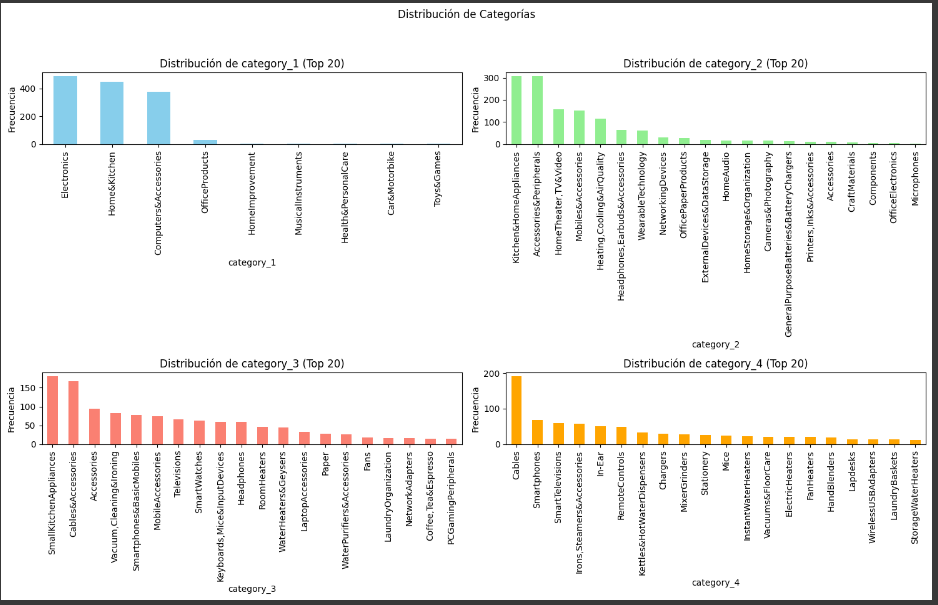
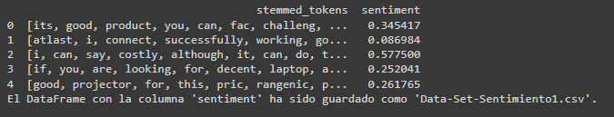
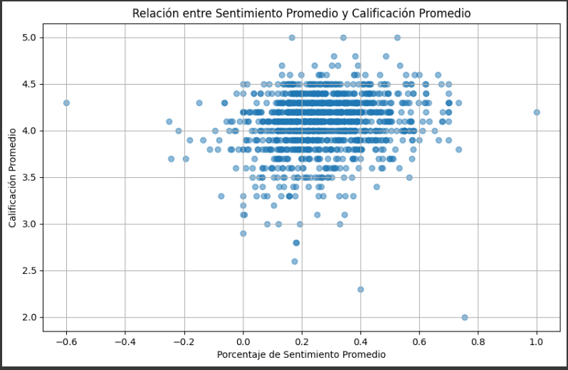

# Proyecto4_DataLab

### Temas

- [Introducción](#introducción)
- [Herramientas](#herramientas)
- [Procesamiento](#procesamiento)
  - [Limpieza de datos ](#limpieza_de_datos)
  - [Análisis exploratorio](#análisis_exploratorio)
  - [Hipótesis](#hipótesis)
  - [Score de Riesgo](#score_de_riesgo)
  - [Regresión Logistica](#regresion_logistica)
- [Conclusiones](#Conclusiones)
- [Recomendaciones](#Recomendaciones)
- [Recursos](#Recursos)

## Introducción

Datalab, una empresa de consultoría innovadora que se especializa en el análisis de datos, con el objetivo de ofrecer soluciones analíticas avanzadas.

Datalab se ha establecido como un socio de confianza para una variedad de empresas en distintos sectores. Su modelo de consultoría único permite a sus analistas de datos seleccionar proyectos que se alineen con sus intereses y experiencia, optimizando así la aplicación de sus habilidades técnicas en los contextos donde pueden tener un mayor impacto

### Objetivo

 El objetivo de este análisis es entender las tendencias y patrones en las calificaciones y reseñas de productos disponibles en Amazon, con el fin de proporcionar insights que puedan ayudar a mejorar la estrategia de precios, descuentos y satisfacción del cliente. 

### **Herramientas**
  1. Google BigQuery
  2. Google Colab
  3. Tableu
  4. Visual Studio

## **Procesamiento**

### 1.1 Limpieza de datos 

Se normalizan los datos de la tabla amazon_review.

Se realiza exploracion de los dos data set proporcionados:

1.- Nulos

Tabla: amazon_product
  * about_product - 4
  * discount_percentage - 0
  * actual_price - 0
  * category - 0
  * product_name - 0
  * product_id - 0
  * user_id - 0
  * discounted_price - 0

>Nulos
>

      Acciones: Se eliminan los 4 nulos de about_product

Tabla: amazon_review
  * user_id - 0
  * user_name - 0
  * review_title - 0
  * review_id - 0
  * review_content - 0
  * img_link - 466
  * product_link - 466
  * product_id - 0
  * rating - 0
  * rating_count - 2

>Imputación de nulos en raiting_count
>

        Acciones: 
        + Valores nulos en img_link y product_link: Se decidió mantener los valores nulos en estas columnas ya que no son variables críticas para el análisis.
        + Imputación de valores en rating_count: Se calcularon las medias de rating_count basadas en los valores de rating. Para el rating de 5, la media fue de 14, mientras que para el rating de 3, la media fue de 467. Estos valores fueron utilizados para imputar los nulos en rating_count.
 

2.- Duplicados

Tabla: amazon_product
  * about_product - 130
  * discount_percentage - 89
  * actual_price - 190
  * category - 136
  * product_name - 102
  * product_id - 96
  * discounted_price - 1870

  > duplicados product id (desglose)
  >

    Acciones:
     + En la columna product_id, identificamos 96 valores únicos que originalmente estaban duplicados. Sin embargo, estos valores aparecen duplicados múltiples veces, resultando en un total de 214 duplicados en el dataset. Esto significa que hay 118 duplicados adicionales que no fueron contabilizados inicialmente, por lo que se decide a eliminarlos de nuestro data_set, como resultado, se obtuvieron un total de 1,351 registros únicos.

Tabla: amazon_review
  * user_id - 144
  * user_name - 144
  * review_title - 144 originales (271 omitidos)
  * review_id - 144 originales (271 omitidos)
  * review_content - 141 originales (253 omitidos)
  * img_link - 49
  * product_link - 1
  * product_id - 92
  * rating - 21
  * rating_count - 204 

Duplicados desglosados
>
>

    Acciones: 
    + En la columna product_id, identificamos 92 valores únicos que originalmente estaban duplicados. Esto significa que hay 114 duplicados adicionales que no fueron contabilizados inicialmente, por lo que se decide a eliminarlos de nuestro data_set, como resultado, se obtuvieron un total de 1,351 registros únicos.

3.- Valores fuera del alcance 

Tabla: amazon_product
  * about_product - 4 datos faltantes
  * discount_percentage - 315 porcentajes que no coinden con el discounted_price
  * actual_price - 0 precios correctos
  * category - 0
  * product_name - 0 
  * product_id - 0
  * discounted_price - 0

Se llevó a cabo una verificación de la consistencia y coherencia de los precios y descuentos registrados en la tabla amazon_product, con el objetivo de identificar y corregir posibles errores en los datos antes de realizar análisis más profundos o tomar decisiones informadas. Esta validación garantiza que los precios y descuentos reflejen con precisión la realidad del producto, preservando la integridad y confiabilidad de los datos. Se encontraron 27 product_id, que presentan algún tipo de inconsistencia entre discounted_price, actual_price y discount_percentage.

Tabla: amazon_review
  * user_id - 0
  * user_name - 0
  * review_title - 0
  * review_id - 0
  * review_content - 0
  * img_link - 0
  * product_link - 0
  * product_id - 0
  * rating - 0
  * rating_count - 

Se detectan variables con una cadena de valores dividida por comas o puntos en una misma varible ("user_id", "user_name","review_title", "review_id", "review_content"). 

En el proceso de limpieza y transformación se dividió la categoría de los productos en varias columnas para facilitar su análisis. También se limpió la columna que describe los productos eliminando caracteres no deseados, como emojis, paréntesis y espacios innecesarios, asegurando que el texto quedara libre de ruido.

Adicionalmente, se analizó la columna de identificadores de usuarios, contando cuántos ID estaban presentes en cada registro. Las reseñas también fueron limpiadas de signos, emojis y otros caracteres no alfabéticos, dejando solo el texto relevante para el análisis. Estas transformaciones permiten trabajar con un conjunto de datos más estructurado y limpio, adecuado para análisis posteriores y generación de insights. Concluyendo en una sola tabla que se llama datset.

>
>

4.- Normalización de datos

Derivado de la exploración se toma la decisión de normalizar los datos para evitar redundancias al eliminar los user_id y review_id excedentes.

>
>

### 1.3 Análisis exploratorio

1.- Agrupación de las variables categoricas

  * Visualización de la distribuición de los productos

  >
  > 

  * Visualizacion de productos con Top Rating

  >
  > 

  
  * Visualizacion de medidas de tendencia central

  >
  >

  * Distribuición de las variables
  
  Raiting:
  >
  >

    Interpretación: La mayoría de los usuarios parecen estar bastante satisfechos, ya que la mayoría de las calificaciones se sitúan en el rango de 4.0 a 4.5. Existen pocos usuarios que hayan dado calificaciones significativamente bajas (por debajo de 3.0).

  Categorias:

  >
  >

  * Cuartiles
  >
  >

  ### 1.2 Análisis de Sentimiento

El análisis de sentimiento, también conocido como minería de opinión, es una técnica de procesamiento de lenguaje natural (NLP) utilizada para identificar y extraer información subjetiva de un texto. Su objetivo principal es determinar la actitud, opinión o emoción de un autor respecto a un tema, producto o servicio en particular. El análisis de sentimiento clasifica el texto en categorías como positivo, negativo o neutral, y en algunos casos, puede identificar emociones más específicas como alegría, ira o tristeza.

Procesamiento:
* Tokenización: El texto se divide en unidades más pequeñas, como palabras o frases, que luego se analizan individualmente.

* Asignación de Sentimiento: Cada palabra o frase se evalúa para determinar su "carga emocional". Esto se puede hacer utilizando lexicones de sentimiento (listas predefinidas de palabras con sus correspondientes valores de sentimiento) o modelos de machine learning entrenados en grandes conjuntos de datos etiquetados.

* Cálculo del Sentimiento Global: El sentimiento global del texto se calcula combinando los valores de sentimiento individuales de cada palabra o frase. Esto puede ser un simple promedio o una suma ponderada dependiendo del enfoque.

Identificación de palabras positivas o negativas
>
>

Calculo del sentimiento mediante la asignacion de puntuaciones al sentimiento a cada texto.

>
>

Fila 0:

Tokens: ['its', 'good', 'product', 'you', 'can', 'fac', 'challeng', ...]

Sentimiento: 0.345417

* Interpretación: Este valor de sentimiento (0.345417) sugiere un sentimiento moderadamente positivo. Es probable que el texto esté expresando una opinión favorable, indicando que el producto cumple con las expectativas y es útil.

Fila 1:

Tokens: ['atlast', 'i', 'connect', 'successfully', 'working', 'go', ...]

Sentimiento: 0.086984

* Interpretación: Este valor de sentimiento (0.086984) indica un sentimiento ligeramente positivo, pero bastante débil. Es posible que el texto refleje un resultado positivo, aunque con alguna duda o con una experiencia que no fue totalmente satisfactoria.

Fila 2:

Tokens: ['i', 'can', 'say', 'costly', 'although', 'it', 'can', 'do', 't', ...]

Sentimiento: 0.577500

* Interpretación: Este valor de sentimiento (0.577500) es marcadamente positivo, lo que sugiere que el texto transmite una opinión favorable y sólida. Es probable que el autor del texto esté satisfecho con el producto, a pesar de posibles inconvenientes mencionados, como el costo.

Fila 3:

Tokens: ['if', 'you', 'are', 'looking', 'for', 'decent', 'laptop', 'a', ...]

Sentimiento: 0.252041

* Interpretación: Este valor de sentimiento (0.252041) indica un sentimiento moderadamente positivo. El texto probablemente expresa una opinión bastante favorable, aunque puede mencionar alguna advertencia o limitación sobre el producto.

Fila 4:

Tokens: ['good', 'projector', 'for', 'this', 'pric', 'rangenic', 'p', ...]

Sentimiento: 0.261765

* Interpretación: Este valor de sentimiento (0.261765) sugiere un sentimiento ligeramente positivo. El texto parece expresar una opinión favorable sobre el producto, destacando aspectos positivos, aunque tal vez con ciertas reservas sobre el precio o alguna otra característica.

Distribución de los sentimientos

>
>

Promedio de sentimientos por categoria

>
>

Interpretación: 

* Toys & Games: Tiene el promedio de sentimiento más alto, superior a 0.4. Esto sugiere que los productos en esta categoría generan una respuesta muy positiva en los usuarios.

* Home & Kitchen y Home Improvement: Ambas categorías también muestran un promedio de sentimiento alto, cercano a 0.4. Esto indica que los productos para el hogar son bien recibidos por los consumidores, con reseñas generalmente positivas.

* Office Products y Electronics: Estas categorías tienen un promedio de sentimiento moderado, alrededor de 0.3, lo que indica una percepción positiva, pero no tan fuerte como en las categorías mencionadas anteriormente.

* Computers & Accessories y Cars & Motorbike: Estas categorías tienen un promedio de sentimiento ligeramente inferior, cerca de 0.25, lo que sugiere una percepción favorable, aunque menos entusiasta que otras categorías.

* Musical Instruments y Health & Personal Care: Estas categorías tienen los promedios de sentimiento más bajos, siendo "Health & Personal Care" la que tiene el promedio más bajo, cercano a 0.15. Esto sugiere que las reseñas en estas categorías son menos positivas en comparación con las demás, lo que podría indicar problemas o insatisfacción con ciertos productos.

### 1.3 Correlación entre variables

>
>

**actual_price y discount_percentage:**

Correlación: -0.11 Existe una correlación negativa muy débil entre el precio actual y el porcentaje de descuento. Esto sugiere que a medida que el porcentaje de descuento aumenta, el precio actual tiende a disminuir ligeramente, aunque la relación es muy débil.

**actual_price y user_id_count:**

Correlación: -0.17 Existe una correlación negativa débil entre el precio actual y el número de usuarios que realizan reseñas. Esto podría indicar que los productos con precios más bajos atraen más reseñas, aunque la relación no es muy fuerte.

**discount_percentage y adjusted_rating:**

Correlación: -0.16 Existe una correlación negativa débil entre el porcentaje de descuento y la calificación. Esto sugiere que mayores descuentos podrían estar ligeramente asociados con calificaciones más bajas, aunque la correlación no es significativa.

**user_id_count y rating_count:**

Correlación: 0.01 La correlación entre el número de usuarios que realizan reseñas y la cantidad total de reseñas es prácticamente inexistente. Esto sugiere que estas variables no están relacionadas entre sí ni con otras variables como precios o descuentos.

**adjusted_rating y actual_price:**

Correlación: 0.13 Existe una correlación positiva muy débil entre la calificación ajustada y el precio actual. Esto podría indicar que los productos con precios ligeramente más altos tienden a recibir mejores calificaciones, aunque esta relación es muy débil.

**sentiment y adjusted_rating:**

Correlación: 0.16 Hay una correlación moderadamente positiva entre el sentimiento y la calificación. Esto sugiere que los textos con un sentimiento más positivo tienden a estar ligeramente relacionados con calificaciones más altas.

**sentiment:**

Correlación débil con todas las variables. El sentimiento no muestra una correlación fuerte con ninguna de las otras variables numéricas en el conjunto de datos. Esto indica que las emociones expresadas en las reseñas no dependen significativamente de los precios, descuentos o calificaciones.

### 1.3 Hipótesis

### 1.- Hipótesis sobre la Correlación entre Descuentos y Calificaciones:  
"Los productos con mayores descuentos tienden a tener calificaciones promedio más bajas debido a la percepción de menor calidad."

Aquí tienes una versión parafraseada y más corta del texto:

**Metodología:**

1. **Asignación de Variables Clave:**
    * **Discount Percentage:** Representa el nivel de descuento aplicado a cada producto.
    * **Adjusted Rating:** Calificación promedio ajustada según las reseñas de los consumidores.

2. **Cálculo y análisis de Correlaciones:**
    * **General:** Se calculó la correlación entre el porcentaje de descuento y la calificación para diferentes categorías de productos, indicando la relación lineal entre descuentos y calificaciones promedio.
    * **Por categoría:** Se calculó la correlación de porcentaje de descuento y calificación para las categorías más solicitadas del análisis.

>>>
>

**Correlación**
>
>

 *Correlación general -0.17*

* Calificaciones Altas (4.0 - 4.75): En este rango de calificaciones, hay una concentración de productos con una gran variedad de descuentos, lo que sugiere que algunos productos con buenos descuentos pueden mantener calificaciones altas.
* Calificaciones Medias (3.0 - 4.0): La dispersión es más amplia en este rango, con una mezcla de calificaciones para diferentes porcentajes de descuento.
* Calificaciones Bajas (2.75 - 3.5): La línea de tendencia muestra que en este rango, el porcentaje de descuento es ligeramente más alto, lo que apoya la hipótesis.

*Correlación por categoria*

>
>

Correlaciones Negativas:

* Home&Kitchen (-0.2374): Esta correlación negativa moderada sugiere que en la categoría Home&Kitchen, los productos con mayores descuentos tienden a tener calificaciones promedio más bajas. Esto respalda la hipótesis, ya que los consumidores podrían percibir que los productos con mayores descuentos en esta categoría son de menor calidad, lo que se refleja en calificaciones más bajas.

* Electronics (-0.1923): Indica que los productos con mayores descuentos podrían estar siendo percibidos como de menor calidad, lo que lleva a calificaciones más bajas.

* OfficeProducts (-0.1351) y Computers&Accessories (-0.1015): Estas categorías muestran correlaciones negativas más débiles, lo que sugiere que aunque la tendencia existe, es menos pronunciada. Los descuentos en estas categorías pueden tener un impacto menor en la percepción de calidad, pero aún se observa una ligera tendencia a que mayores descuentos se asocien con calificaciones más bajas.

Correlaciones Positivas:

* HomeImprovement (1.0) y MusicalInstruments (1.0): Estas correlaciones perfectas sugieren lo contrario a la hipótesis en estas categorías. Aquí, los productos con mayores descuentos parecen recibir calificaciones promedio más altas. Esto podría deberse a que los consumidores perciben los descuentos en estas categorías como una excelente relación calidad-precio, en lugar de una indicación de baja calidad. Es posible que en estas categorías específicas, los descuentos sean interpretados positivamente, lo que refuerza la percepción de valor en lugar de la percepción de menor calidad.

**Conclusiones**

El concepto de que "los productos con mayores descuentos suelen tener calificaciones promedio más bajas debido a la percepción de menor calidad" se confirma en  cierta parte, pero no se aplica de manera universal a todas las categorías de productos. En algunas categorías, esta relación es válida, mientras que en otras, la correlación es positiva, indicando que los descuentos pueden ser vistos de manera favorable.

### 2.- Hipótesis sobre la Gestión de la Reputación y Reseñas Negativas:

 "Un mayor número de reseñas negativas está asociado con una menor calificación promedio de los productos."

Metodología:
  
1. Utilizamos la calificación promedio ajustada de los productos como la variable dependiente.
2. Definimos las reseñas negativas en función del análisis de sentimiento, considerando como negativas aquellas reseñas cuyo puntaje de sentimiento era menor o igual a 0.
3. Los productos fueron segmentados por categorías (category_1, category_2, category_3, y category_4) para analizar la relación dentro de cada categoría.
4. Se calculó la correlación de Pearson entre el número de reseñas negativas y la calificación promedio dentro de cada categoría de productos.
5. Significancia Estadística: Se utilizó el valor p para determinar la significancia estadística de las correlaciones. Un valor p menor a 0.05 indicaría que la correlación es significativa.

>
>

**Interpretación:**

  * **Distribución de Datos:**
  La mayoría de los productos tienen pocas o ninguna reseña negativa, concentrándose en la parte superior izquierda de la gráfica, lo que indica altas calificaciones promedio.

  * **Correlación Observada:**
  Aunque algunos productos tienen reseñas negativas, esto no afecta significativamente la calificación promedio. La correlación de Pearson (-0.0819) muestra una leve tendencia negativa, pero no fuerte.

  * **Significado del Valor p:**
  El valor p (0.0025) indica que la correlación, aunque débil, es estadísticamente significativa, sugiriendo que la relación observada no es por azar.

  * **Productos Específicos:**
  Algunos productos, como B00K32PEW4, tienen calificaciones altas a pesar de algunas reseñas negativas, indicando que unas pocas reseñas negativas no afectan mucho si hay suficientes reseñas positivas.
 

  **Conclusiones:**

  El análisis realizado no encontró correlaciones negativas significativas entre el número de reseñas negativas y la calificación promedio de los productos en ninguna de las categorías analizadas. Esto sugiere que, aunque existen relaciones negativas en algunas categorías, estas no son lo suficientemente fuertes como para ser consideradas estadísticamente significativas. Este resultado indica que otros factores podrían estar influyendo en las calificaciones de los productos, más allá del simple conteo de reseñas negativas.

### 3. Hipótesis sobre la Calificación Promedio y el Número de Seseñas

"Un mayor número de reseñas está asociado con una mayor calificación promedio de los productos."

Metodología:

1. Se calcula la correlación entre variables
2. Se filtro la cantidad de reseñas.

>
>

**Interpretación:**

* El coeficiente de correlación es 0.099, indica una relación positiva muy débil entre el número de reseñas y la calificación promedio.
* El valor p es extremadamente bajo (0.000315), lo que nos dice que la correlación observada no es una coincidencia. Aunque la relación entre las variables es débil, la baja probabilidad de que ocurra por azar confirma que es significativa desde el punto de vista estadístico.

**Conclusiones**

La Hipótesis es Parcialmente Válida: Aunque existe una correlación estadísticamente significativa entre el número de reseñas y la calificación promedio, la fuerza de esta relación es extremadamente débil (correlación de 0.099). Esto sugiere que el número de reseñas por sí solo no es un predictor fuerte de una calificación promedio más alta ni de una calificación promedio.

### 4. Hipótesis sobre Palabras Clave en Reseñas de Productos Altamente Calificados:

 "Las palabras clave más comunes en las reseñas positivas están asociadas con características específicas del producto, como la facilidad de uso o el rendimiento.”

 Metodología:
 
 1. Segmentación de palabras positivas.
 2. Mapeo de caracteristicas clave del producto.

>
>

>
>

**Interpretación:**
1. Calidad:

    - Frecuencia: La característica "calidad" fue mencionada en 719 reseñas positivas, lo que representa el 71.19% de todas las reseñas positivas.Lo que sugiere que la percepción de alta calidad es una característica muy importante y común entre los productos que reciben calificaciones altas. La "calidad" parece ser un factor clave para los clientes satisfechos.

2. Facilidad de Uso:

    - Frecuencia: La "facilidad de uso" fue mencionada en 437 reseñas positivas, representando el 43.27%. La facilidad de uso es también una característica importante, aunque menos mencionada que la calidad. Esto podría indicar que, mientras los productos fáciles de usar son valorados positivamente, la calidad aún es un factor más dominante.

3. Rendimiento:

    - Frecuencia: El "rendimiento" se mencionó en 409 reseñas positivas, lo que equivale al 40.50%. El rendimiento es crucial para un gran número de usuarios. Es un factor importante, pero no tanto como la calidad o la facilidad de uso.

4. Durabilidad:

    - Frecuencia: La "durabilidad" fue mencionada en 213 reseñas, representando el 21.09%. La durabilidad es la menos mencionada entre las características, lo que podría sugerir que no es un factor tan determinante para los productos altamente calificados, o bien que los clientes no encuentran problemas con la durabilidad en la mayoría de los productos bien valorados.

**Conclusiónes:**

Estos resultados indican que las palabras clave más comunes en las reseñas positivas están, efectivamente, asociadas con características específicas del producto. En particular, la calidad es la característica más prevalente, seguida por la facilidad de uso y el rendimiento. La durabilidad, aunque importante, es mencionada con menos frecuencia.

### 5. Hipótesis sobre la Predicción del Comportamiento del Consumidor:

"El análisis de sentimientos en las reseñas puede predecir con precisión la tendencia general de la satisfacción del cliente, indicando si es probable que aumente o disminuya en el futuro"

Metodología:

1. Se realizo el calculo promedio de sentimiento y calificación.
2. Se calcula la correlación entre variables

>
>

Interpretación:

La mayoría de los datos están concentrados alrededor de puntuaciones de sentimiento (entre -0.2 y 0.4) y calificaciones promedio que oscilan entre 3.5 y 4.5.

* Calificaciones Altas: Los productos con calificaciones promedio de 4.5 y 5.0 parecen tener puntuaciones de sentimiento moderadas, lo que sugiere que un sentimiento positivo no es necesariamente el único factor que impulsa las calificaciones altas.
* Sentimiento Negativo: Algunas calificaciones de productos caen en el rango de sentimientos negativos (por debajo de 0), lo que es consistente con calificaciones promedio más bajas.

**Conclusiones:**

 La correlación de 0.16 entre las variables, sugiere aunque existe una relación positiva entre el sentimiento y la calificación, esta relación es débil. 
 A pesar de que existe una ligera tendencia entre la satisfacción del cliente y la calificiones más altas, la hipótesis no puede ser del todo respaldada.

### 6 . Hipótesis sobre las Calificaciones Promedio por Categoría de Producto

"Las categorías de productos que tienen una mayor calificación promedio también tienen una mayor satisfacción del cliente."

**Metodología:**
1. Agrupación de variables.
2. Calcular la calificación promedio de cada variable.

>
>

**Interpretación:** Una correlación de 0.85 indica una fuerte relación positiva entre la calificación promedio y la satisfacción promedio.

**Conclusión:**

La hipótesis 6 está respaldada por los datos. Existe una relación fuerte entre las calificaciones promedio y la satisfacción promedio por categoría de producto, lo que indica que las categorías con mayores calificaciones promedio también tienen mayor satisfacción del cliente.

## Riesgo Relativo

**1. Categoría de Descuento vs Categoría de Calificación**

>
>

>
>

**Interpretación:**

Los productos con un alto descuento (mayor a 62%) tienen 3.03 probabilidades de tener una calificación baja (menor a 3 estrellas) en comparacíon a otros productos con bajo o nulo descuento.

**2. Riesgo Relativo de una Calificación Alta por Categoría de Producto**

**Interpretación:**

* MusicalInstruments: La categoría tiene un 50% de productos con calificaciones altas (≥ 4).
* Health&PersonalCare, HomeImprovement, OfficeProducts, Toys&Games: Los productos en estas categorías son dos veces más propensos a recibir calificaciones altas.

* Computers&Accessories: Esta categoría tiene un 64.8% más de probabilidad de recibir calificaciones altas que MusicalInstruments.

* Electronics: Los productos en la categoría "Electronics" tienen un 47.8% más de probabilidad de recibir calificaciones altas.

* Home&Kitchen: Esta categoría tiene un 35.2% más de probabilidad de recibir calificaciones altas.

## **Regresión Logística**
** 

### **Conclusiones**

### **Recomendaciones**

## **Recursos**

### Presentación del Proyecto 
Accede a la presentación del proyecto haciendo clic [aquí](https://drive.google.com/file/d/1GdkslQ3pPk7i1k2rmBQY7mdTkbuySkSC/view?usp=sharing)